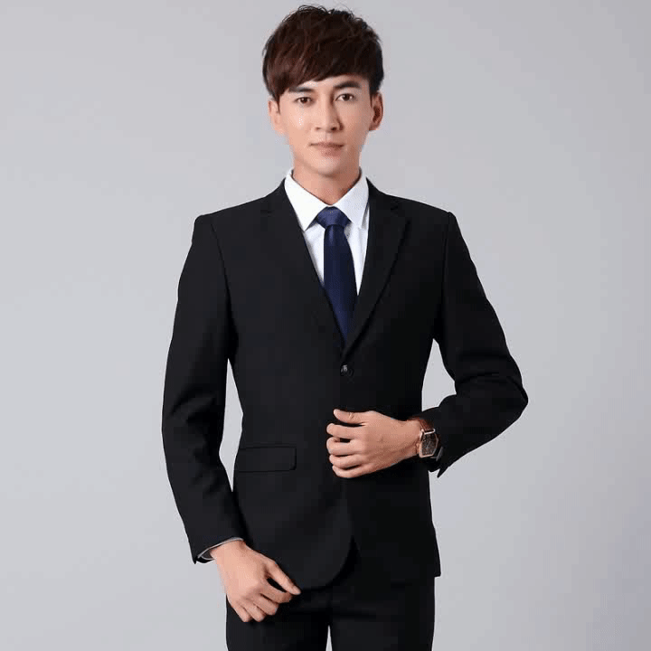

# SadTalker Triton server demo

## Env
1. 服务镜像 \>= tritonserver_22.11  差的包，参考*_reference.txt
2. 客户端(或tritonclient 镜像) 差的包，参考*_reference.txt

## Using 
[百度网盘链接](https://pan.baidu.com/s/1ZgFRmuwVJi26umSVN5BzmQ?pwd=gogs) 提取码: gogs

0. `download weights.zip and unzip weights.zip in onnx_weights and add generator.onnx and kp_detector.onnx `
1. `cd SadTalkerTriton`
2. `docker run -v $PWD:/models --gpus device=1 --shm-size 1g  -it --name sadtalker_triton tritonserver_22.11_pypack(your image name)`
3. in server container: `tritonserve --model-repo ./ `
4. in client container: `python client.py `

## I did
1. Export all submodel to onnx and runtime with onnx_privider_trtfp16
2. Removed the facexlib and replace the face detection module for simple and fast
3. Clean the repeate functions in the pipeline
4. Extract useful model weights and structure codes
5. Removed unnecessary features
## You can do
1. Dynamic batching
2. More efficient organization compliant with triton
3. int8 for generator network

## Reminder
1. generator.onnx and kp_detector.onnx you must do it by yourself,it's big and some licence.

## Galary

